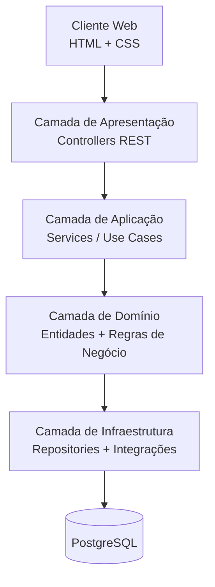

# Sistema de Gestão Acadêmica (SGA)

## 📌 Descrição do Projeto
Este projeto consiste no desenvolvimento de um Sistema de Gestão Acadêmica (SGA) para uma universidade de médio porte, com o objetivo de substituir um sistema legado fragmentado por uma solução integrada, escalável e segura.

O sistema irá centralizar a gestão de:
- Alunos
- Professores
- Disciplinas
- Matrículas
- Notas e Frequências

---

## 👥 Integrantes
- Bruno Ferreira Silva
- Tiago Sales Ribeiro
- Victor Rangel Tasse Magalhães
- Walisson Fagundes Santana

---

## 🎯 Objetivo
Desenvolver uma plataforma unificada que:
- Elimine a fragmentação dos sistemas atuais
- Garanta integridade dos dados acadêmicos
- Facilite a emissão de históricos e relatórios

---

## ⚠️ Desafios do Projeto
- Resistência dos usuários à mudança
- Prazo restrito
- Equipe reduzida

---

## 🧱 Escopo Funcional
- Gerenciamento de alunos, professores e disciplinas
- Matrícula e enturmação
- Registro de notas e frequência
- Emissão de históricos e relatórios
- Portais web responsivos

---

## 🚫 Fora do Escopo
- Refatoração dos sistemas legados
- Gestão contábil interna
- Infraestrutura física de rede
- integração com sistemas legados (financeiro e biblioteca)
---

## 🏗️ Arquitetura

### Modelo Arquitetural
Proposta inicial baseada em **Arquitetura em Camadas (Layered Architecture)**:



### Estrutura de Pastas (Spring Boot)

```
sga/
├── src/
│   └── main/
│       ├── java/
│       │   └── com/sga/
│       │       ├── controller/        # Camada de Apresentação
│       │       │   ├── AlunoController.java
│       │       │   ├── ProfessorController.java
│       │       │   └── DisciplinaController.java
│       │       ├── service/           # Camada de Aplicação
│       │       │   ├── AlunoService.java
│       │       │   ├── ProfessorService.java
│       │       │   └── MatriculaService.java
│       │       ├── domain/            # Camada de Domínio
│       │       │   ├── model/
│       │       │   │   ├── Aluno.java
│       │       │   │   ├── Professor.java
│       │       │   │   ├── Disciplina.java
│       │       │   │   └── Matricula.java
│       │       │   └── exception/
│       │       │       └── SgaException.java
│       │       ├── repository/        # Camada de Infraestrutura
│       │       │   ├── AlunoRepository.java
│       │       │   └── ProfessorRepository.java
│       │       └── SgaApplication.java
│       └── resources/
│           ├── application.properties
│           └── db/
│               └── migration/         # Flyway migrations
├── frontend/                          # HTML + CSS estático
│   ├── **.jsx              # Desenvolvimento do Front-end em React
├── docker-compose.yml
├── Dockerfile
├── CONTRIBUTING.md
└── README.md
```

---

## ⚙️ Tecnologias

| Camada        | Tecnologia         | Status         |
|---------------|--------------------|----------------|
| Backend       | Spring Boot        | ✅ Definido    |
| Banco de Dados| PostgreSQL         | ✅ Definido    |
| Container     | Docker             | ✅ Definido    |
| Frontend      | React + Nextjs     | ✅ Definido    |
| Autenticação  | A definir          | ⏳ Pendente    |

---

## 🔐 Requisitos Não Funcionais
- Segurança (autenticação e autorização)
- Escalabilidade
- Responsividade
- Consistência de dados

---

## 🚀 Como Rodar

### Pré-requisitos
- Docker e Docker Compose instalados
- Git configurado

### Instalação e Execução

1. **Clone o repositório:**
```bash
git clone https://github.com/Rangelzin/SGA-Central-POO.git
cd SGA-Central-POO
```

2. **Configure as variáveis de ambiente:**
```bash
cp .env.example .env
```

3. **Inicie os containers (Backend + PostgreSQL):**
```bash
docker compose up --build
```

4. **Acesse a aplicação:**
- Backend API: http://localhost:8080
- PostgreSQL: localhost:5432


### Comandos Úteis

**Parar os containers:**
```bash
docker compose down
```

**Limpar volumes e dados:**
```bash
docker compose down -v
```

**Ver logs em tempo real:**
```bash
docker compose logs -f
```

**Reiniciar apenas o backend:**
```bash
docker compose restart backend-app
```

### Desenvolvimento Local (sem Docker)

1. **Instale as dependências do backend:**
```bash
cd sga
./gradlew build
```

2. **Inicie o PostgreSQL localmente:**
```bash
docker run -d \
  --name postgres-local \
  -e POSTGRES_DB=SGAI \
  -e POSTGRES_USER=SGAI \
  -e POSTGRES_PASSWORD=SGAI_1234 \
  -p 5432:5432 \
  postgres:16-alpine
```

3. **Execute a aplicação:**
```bash
./gradlew bootRun
```

A aplicação estará disponível em http://localhost:8080

---

## 📊 Modelagem
- Casos de Uso
- Diagrama de Classes
- Requisitos Funcionais e Não Funcionais

---

## 📎 Observações
Este repositório representa a evolução incremental do projeto acadêmico de POO, com foco em boas práticas de engenharia de software, arquitetura limpa e escalabilidade.
